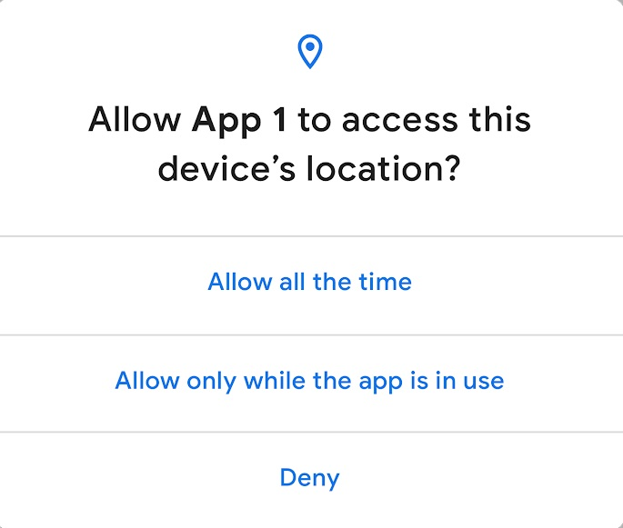

# WithoutInternetLocationUpdatesForegroundService

Android has recently introduced Android Q Beta version that gives more privacy and location sharing options to the users.

Until now, the user had just a single option to allow or deny permission to the app for accessing location. Android tracked location even when the app wasn’t in use.

Starting with Android Q, users will get a new option to permit only when the app is actually being used.

Android Q provides 3 options to the users for accessing location –

 

All the time  –  app can access location at any time

While in use –  app can access location only while the app is being used

Deny – an app cannot access location

These three new options would be in the same dialog box that asks for access to location in an Android app.

### Below Are The Screenshot 
### Output

#### On Android Studio's Logcat  
##### Checking Location Latitude Longitude values in Logcat

 Home screen                               | Foreground Service Screen                                     |
:------------------------------------------:|:-------------------------------------------:
||

